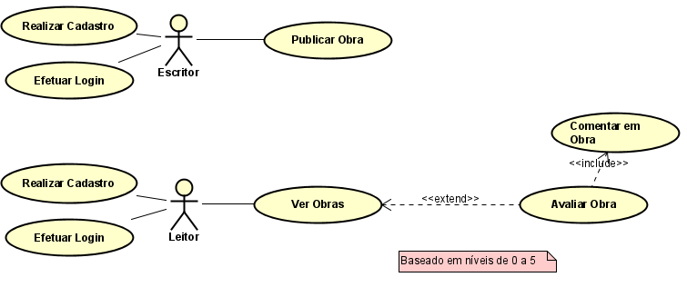
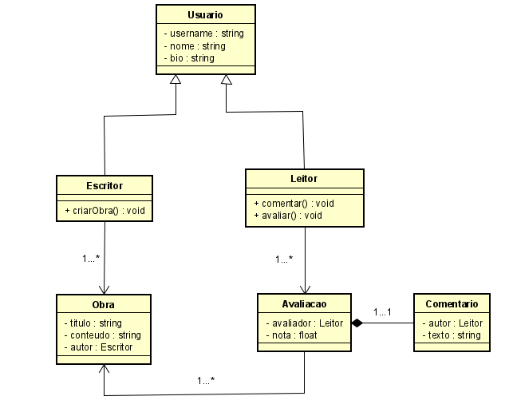
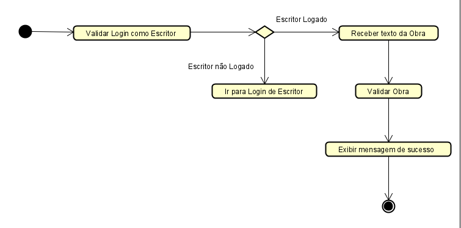
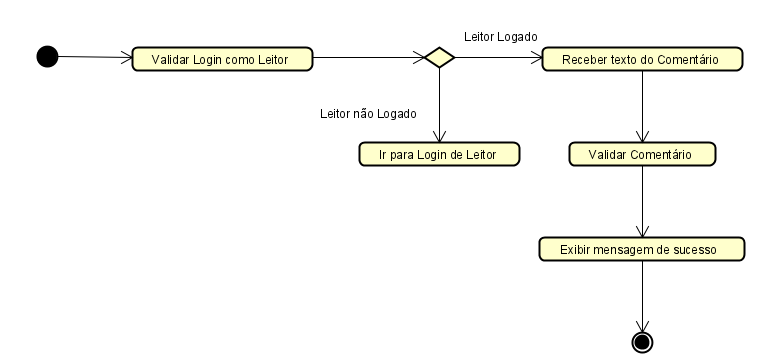
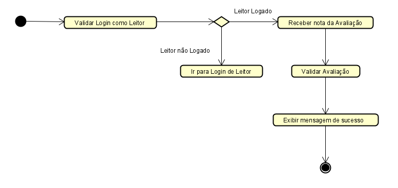
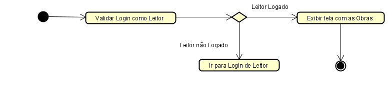

# **Documento de Requisitos**

# **Projeto:** PenConnect

## Uma plataforma digital em que escritores, em especial os amadores, sejam capazes de compartilhar suas histórias com outras pessoas.

# **Integrantes:**

* Ana Clara  
* Diôgo Amador  
* Gustavo Henrique   
* Rafael Araújo

## Requisitos Funcionais

**Cadastrar-se como Escritor**  
**Descrição:** será possível criar um perfil como Escritor, tendo acesso a funcionalidades específicas da plataforma.  
**Nível de Prioridade:** Alta

**Realizar Login como Escritor**  
**Descrição:** o usuário poderá acessar a plataforma com a conta de Escritor criada.  
**Nível de Prioridade:** Alta

**Cadastrar-se como Leitor**  
**Descrição:** será possível criar um perfil como Leitor, capaz de ler e avaliar as Obras publicadas  
**Nível de Prioridade:** Alta

**Realizar Login como Leitor**  
**Descrição:** o usuário poderá acessar a plataforma com a conta de Leitor criada.  
**Nível de Prioridade:** Alta

**Publicar Obras**  
**Descrição:** o usuário, enquanto Escritor, poderá publicar Obras, que ficarão disponíveis para a visualização de outros usuários.  
**Nível de Prioridade:** Alta

**Ver Obras**  
**Descrição:** os usuários, sejam eles Escritores, sejam Leitores, terão acesso às Obras publicadas na plataforma.  
**Nível de Prioridade:** Alta

**Avaliar Obras**  
**Descrição:** Ao visualizarem uma Obra, os Leitores poderão atribuir uma nota a mesma.  
**Nível de Prioridade:** Alta

**Comentar em Obra**  
**Descrição:** leitores também poderão escrever Comentários, fomentando a Avaliação.  
**Nível de Prioridade:** Média

## Requisitos Não Funcionais

**Desempenho**  
**Descrição:** o acesso à plataforma e suas funcionalidades deverá ocorrer com a maior fluidez possível.  
**Nível de Prioridade:** Alta

**Disponibilidade**  
**Descrição:** a plataforma deverá estar disponível para acesso a qualquer momento.  
**Nível de Prioridade:** Alta

**Segurança**  
**Descrição:** usuários deverão acessar fazendo uso de login e senha, esta por sua vez, possuindo criptografia.  
**Nível de Prioridade:** Alta

**Acessibilidade**  
**Descrição:** será feito uso de contraste claro nos elementos das páginas, melhorando a experiência de usuários com deficiência visual parcial.  
**Nível de Prioridade:** Média

**Recuperação de Dados**  
**Descrição:** será possível garantir o resgate de dados após possíveis perdas ou exclusões.  
**Nível de Prioridade:** Média

# **Diagrama de Casos de Uso**

# **Diagrama de Classes**

# **Diagrama de Atividades**
**Publicar Obras**

**Ver Obras**

**Avaliar Obras**

**Comentar em Obra**

